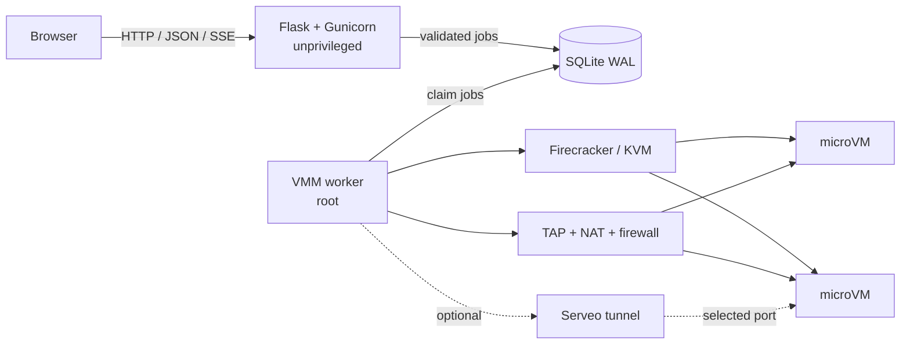

<div align="center">

# HomeCloud

### A small, self-hosted cloud for real Firecracker microVMs

Run isolated Linux instances from a clean web console, open their terminals in
the browser, manage images and snapshots, enforce quotas, and publish selected
services without handing users SSH keys.

[](https://www.python.org/)
[](https://firecracker-microvm.github.io/)
[](#supported-hosts)
[](LICENSE)

</div>

---

HomeCloud turns one Linux host into a compact cloud platform. Each instance is
a hardware-virtualized Firecracker microVM with its own kernel, memory, disk,
network interface, firewall rules, and browser terminal. The web application
runs unprivileged; a separate worker performs the operations that require host
access.

It is designed for homelabs, Raspberry Pi servers, development environments,
classrooms, and small private infrastructure where a full cloud stack would be
unnecessarily heavy.

## Highlights

| Area | What HomeCloud provides |
| --- | --- |
| **Compute** | Firecracker microVM lifecycle, fixed instance types, live resource usage, and safe CPU/RAM/disk upgrades |
| **Console** | Persistent browser terminal over authenticated SSE, with no user-supplied SSH keys |
| **Images** | Verified raw ext4 image imports, private image library, snapshots, and boot-from-image |
| **Networking** | Deterministic private IPv4 addresses, TAP networking, NAT, and per-instance ingress firewall rules |
| **Public access** | Optional host-side Serveo bridge from a public HTTPS URL to one selected VM port |
| **Accounts** | Registration control, signed sessions, API keys, tenant ownership checks, audit log, and rate limits |
| **Administration** | Default and per-user quotas, usage visibility, and one-click update checks and updates |
| **Hosts** | Debian/Ubuntu installation on `amd64` and `arm64`, including supported 64-bit Raspberry Pi hosts |

## How it works



The browser never controls KVM, `iptables`, VM disks, or host processes
directly. HTTP routes validate the request, verify resource ownership and quota,
then enqueue a bounded job. The privileged worker is the only component allowed
to touch the virtualization and networking layers.

## Supported hosts

HomeCloud currently targets:

- Debian 12 or Ubuntu 24.04
- `x86_64` / `amd64`
- `aarch64` / `arm64`, including a Raspberry Pi running a 64-bit OS
- A Linux host with working `/dev/kvm` and `/dev/net/tun`

Firecracker requires hardware virtualization. On a Raspberry Pi, confirm that
KVM is available before installing:

```bash
test -r /dev/kvm && test -w /dev/kvm && echo "KVM is ready"
```

For Proxmox LXC, use a **privileged** container and pass through `/dev/kvm` and
`/dev/net/tun`. Unprivileged LXC commonly cannot provide the device and network
permissions Firecracker needs.

## Quick start

On a fresh supported host:

```bash
git clone https://github.com/pythonIsFast/HomeCloud.git /opt/homecloud
cd /opt/homecloud
sudo ./install.sh
```

The installer sets up:

- Python and the virtual environment
- Firecracker for the detected CPU architecture
- An architecture-matching Linux kernel and Ubuntu root filesystem
- The writable base image used by new instances
- Gunicorn, nginx, systemd services, and the privileged VMM worker
- Host networking tools and the OpenSSH client used for optional Serveo bridges

Open the host's HTTP address, register the first account, and then close public
registration:

```bash
sudo sed -i \
  's/^HOMECLOUD_ALLOW_REGISTRATION=.*/HOMECLOUD_ALLOW_REGISTRATION=0/' \
  /etc/homecloud/homecloud.env
sudo systemctl restart homecloud-web homecloud-vmm
```

> [!IMPORTANT]
> HomeCloud serves plain HTTP by default. Keep it on a trusted private network,
> or place it behind a trusted TLS-terminating reverse proxy before exposing the
> management interface publicly. Set `HOMECLOUD_COOKIE_SECURE=1` when the
> browser reaches HomeCloud exclusively through HTTPS.

For the full host and LXC notes, see [DEPLOYMENT.md](DEPLOYMENT.md).

## Create and use an instance

1. Open **Compute** and choose **New instance**.
2. Select an instance type and either the HomeCloud base image or a private image.
3. Wait for the worker to move the instance from `pending` to `running`.
4. Open the instance and use the **Terminal** tab for its root serial console.
5. Use the dedicated **Firewall**, **Public access**, and **Snapshots** tabs for
   the rest of its lifecycle.

The default instance catalogue is intentionally homelab-sized:

| Type | vCPU | Memory | Disk |
| --- | ---: | ---: | ---: |
| `hc.nano` | 1 | 256 MiB | 1 GiB |
| `hc.micro` | 1 | 512 MiB | 2 GiB |
| `hc.small` | 1 | 1 GiB | 5 GiB |
| `hc.medium` | 2 | 2 GiB | 10 GiB |
| `hc.large` | 4 | 4 GiB | 20 GiB |

An existing instance can move to another type from its Overview tab. CPU and
memory may move up or down within quota. Disks can grow but are never shrunk,
because shrinking a live filesystem image would risk data loss. A running
instance is restarted automatically when its type changes.

## Networking

HomeCloud does not require a DHCP server. Each resource ID deterministically
maps to a private `/30` network inside `10.71.0.0/16` by default:

```text
resource id 1 → 10.71.0.4/30
host gateway  → 10.71.0.5
guest address → 10.71.0.6
```

Outbound traffic is NATed through the host's default interface. Inbound traffic
is denied unless an allow rule matches the protocol, port, and source CIDR.

### Publish a VM port with Serveo

The **Public access** tab can create one anonymous Serveo HTTP tunnel for a
running instance. Enter the port on which the guest service is listening and,
optionally, a preferred subdomain. HomeCloud displays the resulting public URL
and manages the tunnel lifecycle.

The SSH tunnel runs on the HomeCloud host and targets the VM's private address:

```text
public HTTPS URL → Serveo → HomeCloud host → VM private IP:port
```

Nothing is installed inside the guest. Anonymous Serveo tunnels are a
third-party convenience service and may display an interstitial warning or be
subject to Serveo's availability and limits.

## Images and snapshots

- Upload `.ext4` or `.img` files from the web interface.
- The default upload ceiling is 2 GiB and is configurable.
- HomeCloud checks the ext4 superblock, runs a read-only filesystem check,
  recomputes SHA-256 during promotion, and only then marks an image ready.
- Snapshots are created from stopped instances for filesystem consistency.
- New instances can boot from any ready private image owned by the same user.

Uploaded guest code remains untrusted. Validation protects the host-side import
pipeline; it does not certify the software contained in an image.

## Updating

From the host:

```bash
sudo /opt/homecloud/update.sh
```

The updater pulls the tracked branch, updates Python dependencies, rebuilds the
base image for future instances, refreshes systemd/nginx configuration, and
restarts HomeCloud. Existing VM disks are preserved.

Administrators can also use **Administration → Updates** to check `origin/main`
and queue an update through the privileged update service. The page shows the
active update phase, survives the brief web-service restart, and reports the
durable result written to `/var/lib/homecloud/update.status`.

## Configuration

Production settings live in `/etc/homecloud/homecloud.env`.

| Variable | Default | Purpose |
| --- | --- | --- |
| `HOMECLOUD_SECRET_KEY` | generated | Signs browser sessions |
| `HOMECLOUD_ALLOW_REGISTRATION` | `1` | Enables self-service account registration |
| `HOMECLOUD_COOKIE_SECURE` | `0` | Sends the session cookie over HTTPS only |
| `HOMECLOUD_JWT_TTL` | `43200` | Session lifetime in seconds |
| `HOMECLOUD_IMAGE_UPLOAD_MAX_MB` | `2048` | Maximum private image upload size |
| `HOMECLOUD_VM_SUBNET_PREFIX` | `10.71` | First two octets of the private VM network |
| `HOMECLOUD_VM_EGRESS_IF` | auto-detected | Host interface used for VM NAT |
| `HOMECLOUD_VMM_POLL` | `2.0` | Worker polling interval in seconds |
| `HOMECLOUD_UPDATE_BRANCH` | `main` | Branch checked by the admin updater |

Restart the services after changing the environment:

```bash
sudo systemctl restart homecloud-web homecloud-vmm
```

## Security model

- The web service runs as the unprivileged `homecloud` account.
- Only the worker runs as root, because TAP and firewall management require it.
- Every resource lookup is scoped to the authenticated owner.
- Browser sessions use signed HttpOnly cookies; API keys are stored as hashes.
- Security headers include a restrictive Content Security Policy.
- Authentication, APIs, terminal input, and uploads are rate-limited or bounded.
- VM image paths, process IDs, and host internals are not exposed to normal users.
- Browser terminal access is authorized by HomeCloud and does not require SSH keys.

The browser terminal is a root console inside the guest. Anyone who controls a
HomeCloud account controlling that instance controls that VM. Protect the
management interface accordingly.

## Project layout

```text
app/
├── auth/                 accounts, sessions and API keys
├── core/                 dashboard, resources and administration
├── services/compute/     compute API and domain rules
├── vmm/                  privileged Firecracker, network and tunnel worker
├── static/               dependency-free CSS and JavaScript
└── templates/            server-rendered application shell
install.sh                fresh-host installer
update.sh                 in-place updater
DEPLOYMENT.md             deployment reference
CLAUDE.md                 architecture and contributor rules
```

HomeCloud deliberately has no ORM, frontend framework, Redis, Celery, or
JavaScript build pipeline. The runtime dependencies are Flask and Gunicorn;
host operations use standard Linux tooling.

## Current scope

HomeCloud is currently a **single-host** platform with one SQLite database and
one VMM worker. It is a good fit for a private server or homelab, not a drop-in
replacement for a multi-region public cloud. Built-in TLS termination,
multi-host scheduling, load balancers, managed DNS, billing, and live migration
are outside the current implementation.

## Contributing

Read [CLAUDE.md](CLAUDE.md) before changing the project. It documents the
resource pattern, privilege boundary, frontend conventions, dependency policy,
and required Git workflow.

Bug reports and focused pull requests are welcome. Preserve the central rule:
the web process validates and queues; the privileged worker performs host
operations.

## License

HomeCloud is licensed under the [GNU General Public License v3.0](LICENSE).
